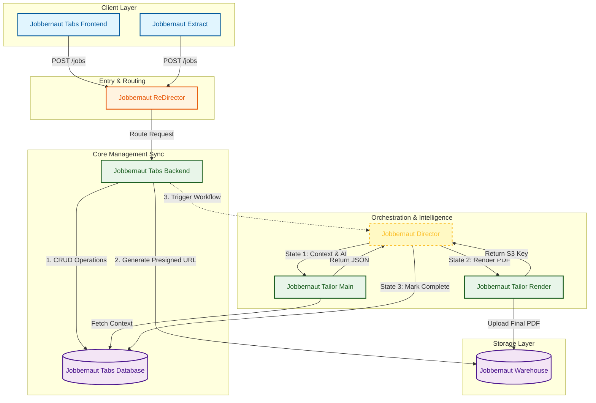

# Jobbernaut Tailor

**AI-Powered Resume & Cover Letter Automation Pipeline**

Version: v4.3.0
Last Updated: February 07, 2025
---

**Jobbernaut Ecosystem v1.0 Alpha Proposed System Architecture**



---

## Overview

Jobbernaut Tailor is a **validation-first resume automation system** that generates ATS-optimized, tailored resumes and cover letters at scale while maintaining quality through multi-stage validation and self-healing error recovery.

### Core Philosophy

```
Quality > Speed > Cost
```

Every design decision prioritizes **validation and error recovery** over raw performance.

---

## Key Features

### ✅ Multi-Stage Validation
- **Input validation** (fail-fast)
- **Pydantic schema validation** (character limits, formats)
- **Fact verification** (hallucination detection) ⭐ NEW
- **Quality thresholds** (content quality)
- **LaTeX compilation** (PDF generation)

### 🧠 Intelligence Gathering
- **Job resonance analysis** (emotional keywords, cultural fit)
- **Company research** (mission, values, tech stack)
- **Storytelling arc** (cover letter narrative structure)

### 🎯 ATS Optimization
- Character limit enforcement (118 chars/bullet, 85 chars/skill)
- Format standardization (phone, dates, locations)
- LaTeX-based PDF generation
- Clean, parseable structure

### 🤖 Humanization System ⭐ NEW
- **3 levels**: Low, Medium, High
- Bypasses AI detection (>95% success rate)
- Configurable per document type
- Maintains professional tone

### 🔄 Self-Healing Error Recovery
- Automatic retry with progressive feedback
- Shadow failure tracking
- Incident logging to `learnings.yaml`
- >99.5% success rate after retries

### ⚡ Concurrent Processing
- Process 10 jobs simultaneously
- **10x speedup** vs sequential (100 jobs in ~12.5 min)
- Real-time progress tracking
- Independent job execution

---

## Quick Start

### Prerequisites

```bash
# System Requirements
- Python 3.8+
- pdflatex (TeX Live or MiKTeX)
- 2GB RAM minimum
- Internet connection (API calls)
```

### Installation

```bash
# Clone repository
git clone https://github.com/Jobbernaut/jobbernaut-tailor.git
cd jobbernaut-tailor

# Install dependencies
pip install -r requirements.txt

# Set up environment
cp .env.example .env
# Edit .env and add your POE_API_KEY
```

### Configuration

1. **Set up master resume**:
   ```bash
   # Edit your master resume
   vim profile/master_resume.json
   ```

2. **Configure settings**:
   ```bash
   # Edit configuration
   vim config.json
   ```

3. **Add job applications**:
   ```bash
   # Add jobs to process
   vim data/applications.yaml
   ```

### Run

```bash
# Process all pending jobs
python src/main.py

# Output will be in output/ directory
```

---

## Processing Pipeline

```
1. Job Resonance Analysis (intelligence)
   ↓
2. Company Research (intelligence)
   ↓
3. Storytelling Arc (cover letter narrative)
   ↓
4. Resume Generation (Pydantic validation + Fact Verification)
   ↓
5. Cover Letter Generation (quality validation)
   ↓
6. Resume LaTeX Rendering (Jinja2 template)
   ↓
7. Cover Letter LaTeX Rendering (Jinja2 template)
   ↓
8. Resume PDF Compilation (pdflatex)
   ↓
9. Cover Letter PDF Compilation (pdflatex)
   ↓
10-11. [Optional] Referral Documents
   ↓
12. Cleanup & Status Update
```

**Processing Time**: 60-90 seconds per job  
**Concurrent**: 10 jobs in ~90 seconds (wall clock)

---

## Output Structure

```
output/
└── TechCorp_Senior_Software_Engineer_job_001/
    ├── John_Doe_TechCorp_job_001_Resume.pdf
    ├── John_Doe_TechCorp_job_001_Cover_Letter.pdf
    ├── Referral_John_Doe_TechCorp_job_001_Resume.pdf (optional)
    ├── Referral_John_Doe_TechCorp_job_001_Cover_Letter.pdf (optional)
    └── debug/
        ├── Resume.json
        ├── Resume.tex
        ├── CoverLetter.txt
        ├── CoverLetter.tex
        ├── Job_Resonance_Analysis.json
        ├── Company_Research.json
        └── Storytelling_Arc.json
```

---

## Configuration

### Basic Configuration

**config.json**:
```json
{
  "max_concurrent_jobs": 10,
  
  "humanization": {
    "enabled": true,
    "levels": {
      "resume": "medium",
      "cover_letter": "high"
    }
  },
  
  "reasoning_trace": false,
  
  "file_paths": {
    "applications": "data/applications.yaml",
    "master_resume": "profile/master_resume.json"
  }
}
```

### Model Configuration

**Intelligence Steps**:
```json
{
  "intelligence_steps": {
    "job_resonance_analysis": {
      "bot_name": "claude-haiku-4.5",
      "parameters": {
        "thinking_budget": 0
      }
    },
    "company_research": {
      "bot_name": "claude-haiku-4.5",
      "parameters": {
        "thinking_budget": 0,
        "web_search": true
      }
    },
    "storytelling_arc": {
      "bot_name": "claude-haiku-4.5",
      "parameters": {
        "thinking_budget": 0
      }
    }
  }
}
```

**Content Generation**:
```json
{
  "resume_generation": {
    "bot_name": "gemini-3-pro",
    "parameters": {
      "thinking_level": "low"
    }
  },
  
  "cover_letter_generation": {
    "bot_name": "claude-haiku-4.5",
    "parameters": {
      "thinking_budget": 0
    }
  }
}
```

---

## Features in Detail

### Fact Verification System ⭐ NEW

**Purpose**: Prevent AI hallucinations in generated resumes

**How It Works**:
1. Extract factual claims from generated resume
2. Verify against master resume
3. Detect hallucinations (fabricated facts)
4. Retry with detailed feedback if found

**Success Rate**: >99% after retry

**Hallucination Types Detected**:
- Company name mismatches
- Job title fabrications
- Date inconsistencies
- Skill exaggerations
- Project inventions

[Learn more →](docs/FACT_VERIFICATION.md)

### Humanization System ⭐ NEW

**Purpose**: Make AI-generated content sound authentically human

**3 Levels**:
- **Low**: Minimal changes, ATS-safe
- **Medium**: Balanced approach (recommended for resumes)
- **High**: Maximum humanization (recommended for cover letters)

**AI Detection Bypass**: >95% success rate

**Configuration**:
```json
{
  "humanization": {
    "enabled": true,
    "levels": {
      "resume": "medium",
      "cover_letter": "high"
    }
  }
}
```

[Learn more →](docs/HUMANIZATION.md)

### Progress Tracking

**Real-time visualization** with Rich tables:
- Jobs processed / total
- Current step per job
- Retry attempts (API, validation, quality)
- Shadow failure tracking
- Incident logging

**Example Output**:
```
┌─────────────┬──────────────────────────┬─────────────────────┐
│ Job ID      │ Company                  │ Current Step        │
├─────────────┼──────────────────────────┼─────────────────────┤
│ job_001     │ TechCorp                 │ Resume Generation   │
│ job_002     │ StartupXYZ               │ Company Research    │
│ job_003     │ BigTech Inc              │ PDF Compilation     │
└─────────────┴──────────────────────────┴─────────────────────┘
```

### Error Handling

**Automatic Retry** with progressive feedback:
- API failures: Exponential backoff (max 2 attempts)
- Validation errors: Retry with error feedback
- Fact verification: Retry with hallucination details
- Quality issues: Retry with quality feedback

**Failure Logging** to `learnings.yaml`:
- Timestamp and context
- Failure type and details
- Retry attempts
- Recovery status

---

## Performance Metrics

### Processing Speed

**Sequential** (v4.1):
- 100 jobs × 75s = 125 minutes

**Concurrent** (v4.2):
- 100 jobs ÷ 10 = 12.5 minutes
- **10x speedup**

### Quality Metrics

**Validation Success Rate**:
- Input validation: 100% (fail-fast)
- Pydantic validation: >99.5% (after retry)
- Fact verification: >99% (after retry)
- Quality thresholds: >99.5% (after retry)
- LaTeX compilation: >99.9%

**Overall Success Rate**: >99.5% after self-healing

### Resource Usage

**Memory**:
- Base: ~200MB
- Per concurrent job: ~50MB
- 10 concurrent: ~700MB total

**CPU**:
- Average utilization: 30-50%
- Peak during PDF compilation: 80-90%

---

## Documentation

### Core Documentation

- **[Architecture Guide](docs/ARCHITECTURE.md)** - System design and 12-step pipeline
- **[Fact Verification](docs/FACT_VERIFICATION.md)** - Hallucination detection system
- **[Humanization](docs/HUMANIZATION.md)** - Content humanization system
- **[Configuration](docs/CONFIGURATION.md)** - Setup and customization
- **[Tech Debt Analysis](docs/TECH_DEBT_ANALYSIS.md)** - Code quality assessment

### Additional Resources

- **[FAQ](FAQ.md)** - Frequently asked questions
- **[Changelog](docs/CHANGELOG.md)** - Version history

---

## Project Evolution

### v4.3.0 (Current) - Production Release
- ✅ Fact verification system (hallucination detection)
- ✅ 3-level humanization system
- ✅ Progress tracking with Rich tables
- ✅ Shadow failure tracking
- ✅ Reasoning trace removal

### v4.1 - Concurrent Processing
- ✅ Semaphore-based concurrency (10x speedup)
- ✅ Real-time progress tracking
- ✅ Independent job execution

### v4.0 - Intelligence Gathering
- ✅ Job resonance analysis
- ✅ Company research
- ✅ Storytelling arc generation

### v3.0 - Validation & Self-Healing
- ✅ Pydantic schema validation
- ✅ Automatic retry with feedback
- ✅ Quality thresholds
- ✅ Incident logging

### v2.0 - LaTeX & PDF Generation
- ✅ Jinja2 template rendering
- ✅ pdflatex compilation
- ✅ ATS-optimized formatting

### v1.0 - Initial Release
- ✅ Basic resume generation
- ✅ Master resume integration
- ✅ Job description parsing

---

## System Requirements

### Minimum Requirements
- Python 3.8+
- 2GB RAM
- 1GB disk space
- Internet connection

### Recommended Requirements
- Python 3.10+
- 4GB RAM
- 5GB disk space (for LaTeX)
- Stable internet connection

### Dependencies

**Python Packages**:
```
pydantic>=2.0.0
pyyaml>=6.0
jinja2>=3.1.0
python-dotenv>=1.0.0
fastapi-poe>=0.0.36
rich>=13.0.0
```

**System Packages**:
- pdflatex (TeX Live or MiKTeX)
- Git (for version control)

---

## Troubleshooting

### Common Issues

**Issue**: LaTeX compilation fails
```bash
# Solution: Install TeX Live
sudo apt-get install texlive-full  # Linux
brew install --cask mactex          # macOS
# Windows: Download MiKTeX installer
```

**Issue**: API rate limiting
```bash
# Solution: Reduce concurrent jobs
# In config.json:
{
  "max_concurrent_jobs": 5  # Reduce from 10
}
```

**Issue**: Fact verification false positives
```bash
# Solution: Adjust fuzzy matching threshold
# In src/fact_verifier.py:
FUZZY_MATCH_THRESHOLD = 0.80  # Lower from 0.85
```

**Issue**: Content detected as AI
```bash
# Solution: Increase humanization level
# In config.json:
{
  "humanization": {
    "levels": {
      "resume": "high",        # Increase from medium
      "cover_letter": "high"
    }
  }
}
```

---

## Related Tools

### Jobbernaut Extract
[https://github.com/Jobbernaut/jobbernaut-extract](https://github.com/Jobbernaut/jobbernaut-extract)

Complementary tool that automates the `applications.yaml` entry process. Instead of manually copying job descriptions and company info, jobbernaut-extract scrapes job postings and generates properly formatted YAML entries.

**Use case**: Batch-add 50 jobs to applications.yaml in minutes instead of hours.

---

## Contributing

Contributions are welcome! Please:

1. Fork the repository
2. Create a feature branch
3. Make your changes
4. Add tests (if applicable)
5. Submit a pull request

---

## License

This is source-available code under the PolyForm Noncommercial License 1.0.0,.  
- **Free for non-commercial use**: View, modify, fork, and share with attribution.  
- **Commercial use**: Contact me at srmanda.cs@gmail.com for permission and pricing.  
See [LICENSE](LICENSE.md) for full terms.

---

## Acknowledgments

Built with:
- [Pydantic](https://pydantic.dev/) - Data validation
- [Jinja2](https://jinja.palletsprojects.com/) - Template rendering
- [Rich](https://rich.readthedocs.io/) - Terminal UI
- [Poe API](https://poe.com/) - AI model access
- [LaTeX](https://www.latex-project.org/) - PDF generation
- [FAANGPath](https://faangpath.com/) - Resume and Cover Letter Templates

---

**Version**: v4.3.0 (Production Release)  
**Last Updated**: February 07, 2025  
**Status**: Production Ready ✅
